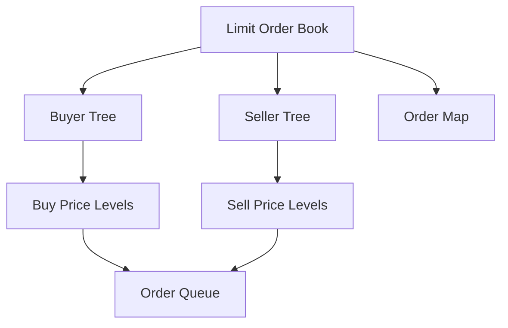
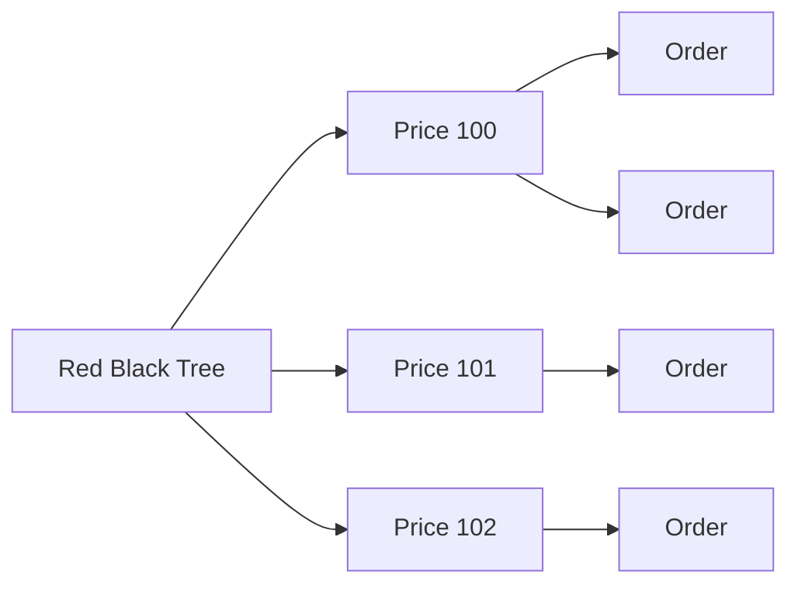

# Limit Order Book

本專案為以 c++ 實做的 limit order book (LOB)。

side project 最初為 DSOOP 中 Red black tree 作業延伸而成。在此基礎之上，將底層 RBT 與 BST 修改成了泛型並且增加了訂單管理、撮合與取消以及資料查詢等 LOB 的核心功能。

此 side project 的長期目標為能夠承接實盤的 point in time 數據，並作為未來量化交易的學習與研究工具。

---
## 目前功能

### 訂單管理

- 限價單下單
- 訂單取消
- 撮合訂單
- 買賣盤管理

### 支援的 Time In Force

- GTC
- IOC
- FOK

### 資料查詢

- Best Bid Price  
- Best Ask Price  
- Best Bid Volume  
- Best Ask Volume  
- Spread 
- Mid Price  
- Top-K Price Levels  
- Volume At Price
---
## 系統架構

### 設計理念

此 side project 以時間與價格為優先度來排序。

- Price Priority：由 Red-Black Tree 維護價格排序  
- Time Priority：由 PriceLevel 內部 FIFO Queue 維護  
- Fast Lookup：透過 Order Map 提供快速訂單查詢與取消

### 總體架構示意圖



### LOB 架構

```
LOB
├─ Buyer Tree
├─ Seller Tree
└─ Order Map
```

- Buyer Tree：儲存 buyer price level（高價優先）  
- Seller Tree：儲存 seller price level（低價優先）  
- Order Map：提供 O(1) time complexity 訂單查詢與取消

### Price Level 架構

```text
PriceLevel
├─ price
├─ total_volume
└─ FIFO Order Queue
```

同價格的訂單依照 first in first out 排序。

### Price Level 與 Order Queue 關係示意圖

