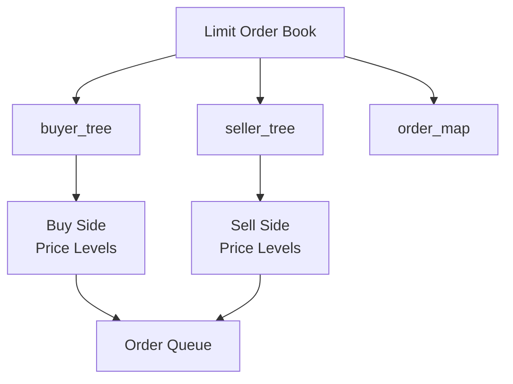
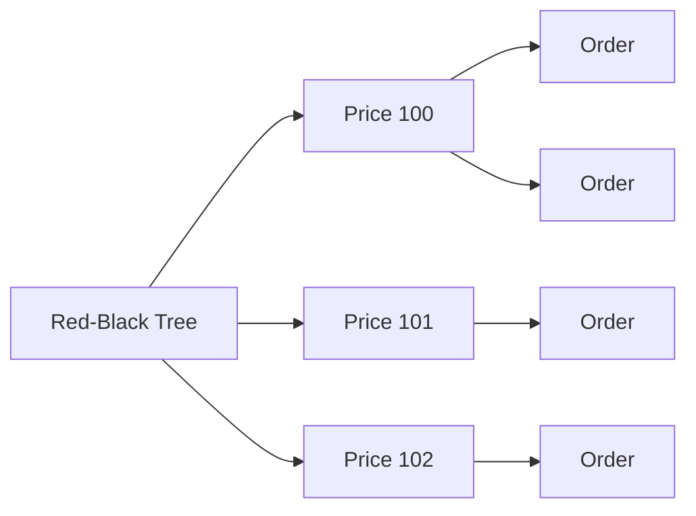

# 系統架構

> 此為**設計筆記**用以記錄系統內部結構，不是使用手冊。要查怎麼下指令，請參見 `doc/main_program_usage.md` / `doc/chart_cli_design.md`。

## 設計理念

此 side project 以時間與價格為優先度來排序。

- Price Priority：由 Red-Black Tree 維護價格排序  
- Time Priority：由 PriceLevel 內部 FIFO Queue 維護  
- Fast Lookup：透過 order_map 提供快速訂單查詢與取消

## 示意圖
### 總體架構示意圖



### LOB 架構

```
LOB
├─ buyer_tree
├─ seller_tree
└─ order_map
```

### Price Level 架構

```text
PriceLevel
├─ price
├─ total_volume
└─ FIFO Order Queue
```

### Price Level 與 Order Queue 關係示意圖



## 細目表

### 1. Order

最小的單位，記錄每一筆委託的詳細資訊。
* `order_id`: 訂單的 ID，用於查詢。
* `volume`: 訂單數量（買或賣多少股/張）。
* `timestamp`: 記錄下單的絕對時間（供回測與稽核使用，在系統中以 queue 中的位置代表相對時間）。
* `price`: 記錄該筆訂單的價格（保留此欄位以利刪單時能查找對應的 Price Level）。
* `Time_In_Force`: 紀錄訂單的 time in force 種類 

### 2. Price Level

Red-Black Tree 的 Node Data，記錄單一 price level 的資訊。
* `price`: 該 level 的價格，作為 RBT 排序與查找的唯一 Key value。
* `total_volume`: 該檔位目前所有訂單數量的總和（總股數），提供報價查詢。
* `order_queue`: 具備 FIFO 特性的 container (`list`)，儲存相同價格下的訂單，維持時間優先。

### 3. Limit Order Book

負責搓合邏輯 price level 的管理。

* `buyer_tree` (Red-Black Tree): 儲存買方 Price Level，價格高者優先 (Max-Tree)。
* `sell_tree` (Red-Black Tree): 儲存賣方 Price Level，價格低者優先 (Min-Tree)。
* `order_map`: 訂單映射表 (`unordered_map`)，紀錄 `order_id` 與在 queue 中記憶體位置 (Iterator) 的對應關係，確保隨機刪單為 O(1) 的 time complexity。